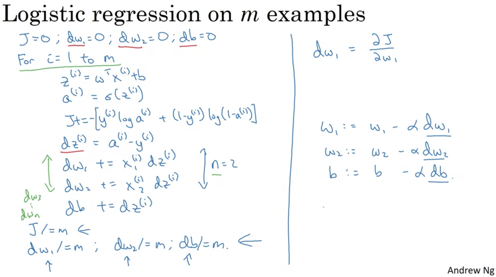
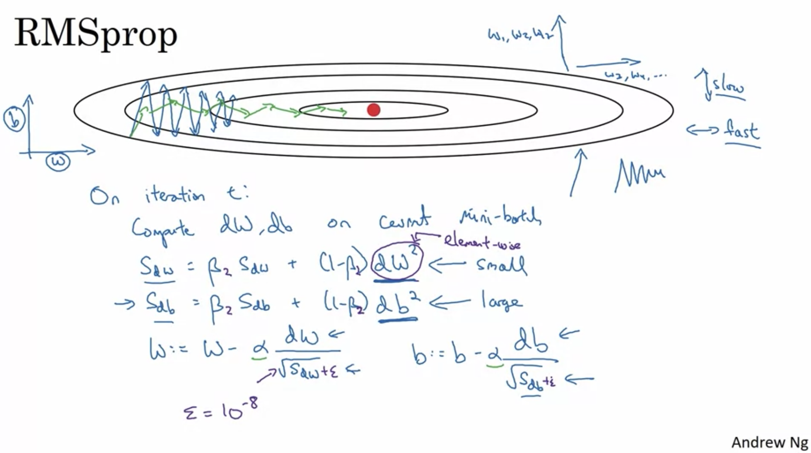
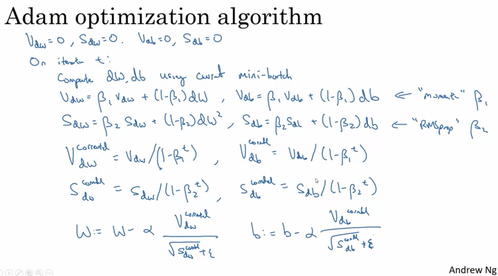
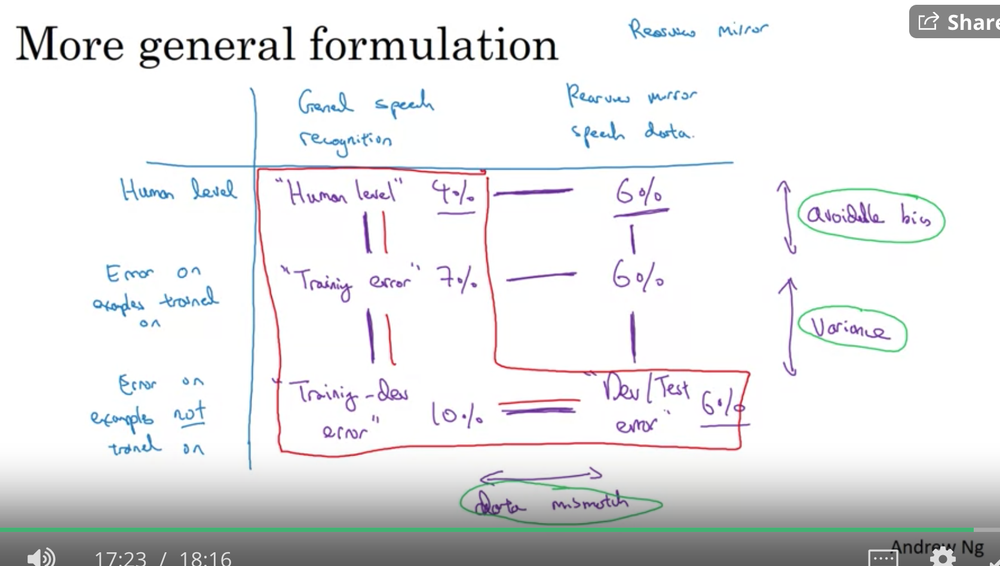

Logistic Regression:
- y_pred = sigma(w^T x+b), sigma(z) = 1/(1+e^-z)
- loss_func = -1/m sum(y_true log y_pred + (1-y_true) log (1-y_pred))
- goal is to minimize loss_func (convex)

  - Gradient descent optimizer:
    - w = w - alpha * d loss_func / dw 
    - in code, use "dw" = d loss_func / dw, so w = w - alpha * "dw"
    
    Why "dz" = a - y, first "dz" = dL / dz = dL/da * da/dz
    1. dL/da = d/da [-(ylog(a)+(1-y)log(1-a))] = (a-y)/[a(1-a)]
    2. da/dz = d/dz [sigma(z)] = sigma(z) * [1-sigma(z)] = a(1-a)
    3. "dz" = a-y
    - BTW, z = w^T x + b

    
    
  - TODO: when there is regularization?

  - Newton's Method optimizer:
    - not update at w, but at an updated w TODO
        - essentially, root-finding, given x0
        - x_{n+1} = x_n - J'(x_n)/J''(x_n)
    - auto-varying alpha, but equals to 1/J'' TODO?? Converges faster [article](https://towardsdatascience.com/optimization-loss-function-under-the-hood-part-ii-d20a239cde11)
        
        
Activation function:
- sigmoid(z) = 1/(1+e^-z): between (0,1), only useful for output
- tanh(z) = (e^z-e^-z)/(e^z+e^-z): shifted sigmoid, always better than sigmoid for internal, because distribute around 0
- ReLU(z) = max(0,z): good because gradient is 1 for large z
- leaky ReLU(z) = max(0.01z, z): small negative when z < 0, to make gradient non-zero (practically not necessary)  

Propagation (how): 
- Forward: 
  z[1] = w[1]X + b[1], 
  A[1] = g[1] (z[1]), 
  z[2] = w[2]A + b[2],
  A[2] = g[2] (z[2]) = sigma(z[2])
- Backward:
  dz[2] = A[2] - Y,
  dw[2] = 1/m dz[2] A^T[1]
  db[2] = 1/m np.sum(dz[2], axis=1, keepdims=True)
  dz[1] = w^T[2] dz[2] g'[1] (Z[1]) (n[1],m)
  dw[1] = 1/m dz[1] X^T
  db[1] = 1/m np.sum(dz[1], axis=1, keepdims=True)
  
Random Initialization
- If set all 0, all weights will be symmetric (always same)
  
Get dimensions right
- Input X.shape (2,1), 1st layer 3 neurons: z[1].shape=(3,1), 
  - Since z[1] = w[1]X+b[1], we have w[1].shape=(3,2), b[1].shape=(3,1)
- 2nd layer 5 neurons: z[2].shape=(5,1)
  - ...
  
Optimization setups:
- Normalize training and test (same mean and variance) sets
  - why: Otherwise cost func will be dominated by 1 dim; have to use much smaller learning rate to approach the smaller-scale dim
- Vanishing/exploding gradients
  - partial solu: careful random initialization, set var(w[l])=1/n[l-1] (for tanh; but when use ReLU, set to be 2/n[l-1]) 
    - so \sum w_i*x_i add up to a not super large z
- Gradient checking
  - Take w[1], b[1], w[2], b[2], ..., w[l], b[l] into a big vector \theta, we have loss J(\theta)
  - Take dw[1], db[1], dw[2], db[2], ..., dw[l], db[l] into a big vector d\theta
  - Question: Is d\theta the gradient of J(\theta)?
    - d_{numeric}\theta[i] = [J(\theta_1,\theta_2,...\theta_i+\epsilon,...)-J(\theta_1,\theta_2,...\theta_i-\epsilon,...)] / 2\epsilon
    - d\theta[i] = dJ / d\theta_i
    - ||d_{numeric}-d||_2 / (||d_{numeric}||_2+||d||_2) ~ 10**-7 ??
    - 10**-5 needs to check, 10**-3 worry! 
    
Optimization process:
- mini-batch gradient descent:
  - what if m=5,000,000? use fast Vectorization on 5,000 mini-batches of size-1,000
  - notation: z[l]_{t}'s mini batch
  - 1 epoch: 1 pass of entire training set

- Gradient descent with momentum
    - almost always faster than standard GD.. (by avoiding zigzags!)
        - Exponentially weighted avgs
          - Originally, v[t] = beta v[t-1] + (1-beta) theta[t]
          - Bias correction for starting pt (because starting at v[0]=0, cold start)
            - use v[t]/(1 - beta^t)
        - Usually use beta=0.9, like using weighted avg of last ~10 gradients

- RMSprop (hard)
  - 
  
- Adam (Adaptive Moment Estimation)
  - combine Momentum and RMSprop! 
  - 
    - alpha: needs to be tuned
    - beta_1: 0.9 (dw)
    - beta_2: 0.999 (dw^2)
    - epsilon: 10**-8

- Learning rate decay
  - alpha = alpha_0 / (1 + decay_rate * epoch_num)

- Local optima
  - For high-D, not likely to stuck in local optima, but most 0-gradient pts are actually saddles 
  - Plateaus is the real problem for slow learning
  
- Tuning:
  - random grid
  - proper scale
  
- Batch Norm
  - Normalize at each layer, each mini-batch
  - Why work?
    - More robust to data distribution change
    - Small regularization effect, as introduced some noise
  - At test: use stored exponential weighted avg mu,sigma at training time

Structure ML project

- Set up goal
  - Single eval metric
  - Satisfying metric
  - Train/dev/test set distribution
    - mix different categories and shuffle, so have same distribution (at least dev/test)
    - For big data, it's ok to do 98%/1%/1% distribution

- Error Analysis
  - Manully pick 100 wrong decisions, what are distribution of labels?
  - Clean up incorrectly labeled data (training set ok)
  - May create a train-dev set besides train and dev sets (when mismatched distribution)
  
  - Build 1st system quickly (BC there are too many ways to improve) and then iterate
  - Address mismatch: synthesis (but careful of overfitting)

- Transfer Learning:
  - More data in tasks transferred from, less data in transferred to 
  - Multi-task (-label) learning (less used than transfer learning): 
    - lower-level layers can be shared between tasks e.g.
        - has pedestrain? y1
        - has car? y2
        - has stop sign? y3
        - has traffic light? y4
    - loss = L(y1_true,y1_pred) + L(y2_true,y2_pred) + L(y3_true,y3_pred) + L(y4_true,y4_pred)
    - different from softmax (multi-class)
    - amt of data for each task is similar